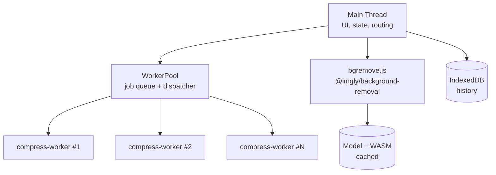

# Clipix

> A privacy-first, fully client-side image toolkit: compress, resize, and remove backgrounds directly in your browser.

## Project Proposal

* [1. Project Description](#1-project-description)
* [2. Goals](#2-goals)
* [3. Specifications](#3-specifications)
* [4. Design](#4-design)

---

## 1. Project Description

### Overview

Clipix is a browser-based image utility built with HTML, CSS, and vanilla JavaScript. It provides two core features:

1. **Image Compression and Resizing:** reduce file size by adjusting quality, dimensions, and format, including a "compress to under X KB" target-size mode.
2. **Background Removal:** remove the background from a photo using an on-device model (`@imgly/background-removal`).

Every processed image is saved to a local **History** section so results can be re-downloaded later.
All processing happens on the user's device. Images are never uploaded to a server.

Clipiz is a static web app that runs entirely in the browser. Heavy work is moved off the main thread using Web Workers and OffscreenCanvas so the interface stays responsive during batch processing. Past results are stored locally in IndexedDB.

### Target Users

- Students and applicants who must meet upload size limits on forms and portals.
- Sellers and creators who need clean cut-outs of product photos.
- Privacy-conscious users who do not want to upload personal photos.

---

## 2. Goals

| # | Goal | Success Criteria |
|---|------|------------------|
| G1 | Compress and resize images client-side | A 4 MB JPEG is reduced to a chosen size/quality and downloaded with no image upload |
| G2 | Remove image backgrounds on-device | A photo with a clear subject yields a transparent PNG/WebP cut-out |
| G3 | Keep the UI responsive during heavy work | No noticeable UI freezing while batch-processing 20 images |
| G4 | Support batch processing | Multiple files are processed in parallel via a worker pool with per-file progress and error handling |
| G5 | Persist a local history | After a page refresh, past results are listed and re-downloadable |

## 3. Specifications

### Functional Requirements

**Compression**
- Accept images via drag-and-drop, file picker, and clipboard paste.
- Control output format, quality, and maximum width/height (aspect ratio preserved).
- Target-size mode: find the highest quality that stays under a user-defined size limit.
- Show original size, new size, and percentage saved.
- Batch queue with per-file status, overall progress, and "Download all".
- Single-image mode exposes quality, width, and format controls; batch mode uses quality 0.7, a maximum width of 1920px, and processes up to four files concurrently.

**Background Removal**
- Lazy-load the model only on first use, with a download progress indicator.
- Show the cut-out on a transparent checkerboard preview.
- Allow background replacement (solid color, gradient, or uploaded image).

**History**
- Save each result (thumbnail, full blob, metadata) to IndexedDB.
- List newest first, with download, delete, and clear-all actions.
- Cap history at 20 items, removing the oldest first.

### Non-Functional Requirements

| Category | Requirement |
|----------|-------------|
| Privacy | No image data leaves the device |
| Performance | Batch work uses up to `min(hardwareConcurrency, 4)` workers |
| Responsiveness | Usable from 360 px wide screens to desktop |
| Reliability | A failing file does not abort the batch |
| Accessibility | Keyboard navigable, visible focus states, ARIA labels |
| Maintainability | ES modules, no build step |

### Technology Stack

| Layer | Technology |
|-------|------------|
| Markup / Styling | HTML5, CSS3 |
| Logic | Vanilla JavaScript (ES modules) |
| Concurrency | Web Workers, custom `WorkerPool` |
| Image processing | `createImageBitmap`, `OffscreenCanvas`, `convertToBlob` |
| Background removal | `@imgly/background-removal` |
| Persistence | IndexedDB (history), Cache API / Service Worker (model and app shell) |
| Async loading | `fetch` with `ReadableStream` for download progress |

## 4. Design

### Architecture

The main thread handles UI and orchestration only. Compression runs in a pool of workers. Background removal runs one image at a time because of its memory footprint.

### Worker Pool

A single worker handles one job at a time, so a batch would leave CPU cores idle. The `WorkerPool` uses:

- **Job queue:** pending jobs `{ payload, onProgress, resolve, reject }`.
- **Worker slots:** each worker is tracked as idle or busy.

With 20 images and 4 workers, 4 run concurrently while 16 wait in the queue. When a worker finishes, it immediately takes the next job. Errors are isolated per job.

