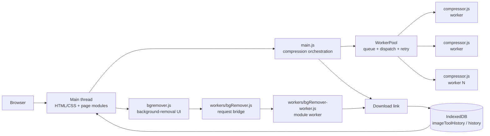
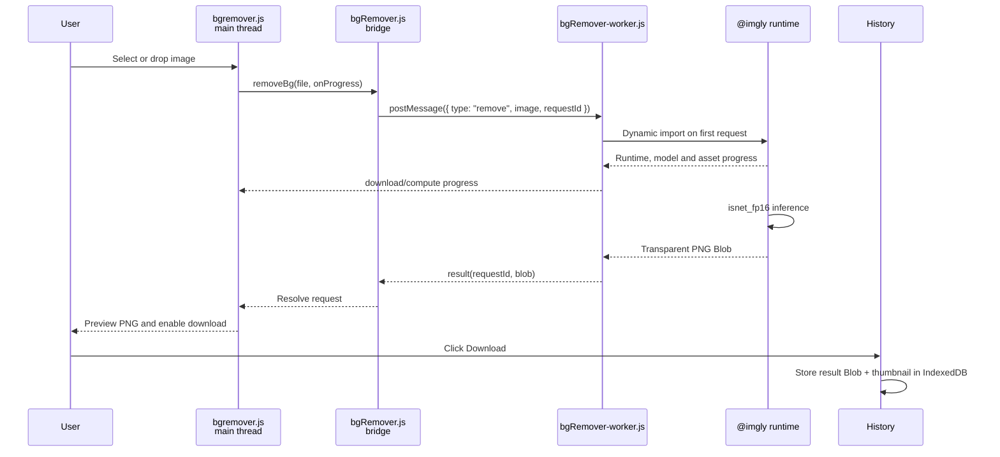
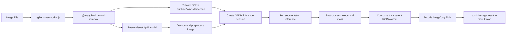
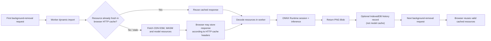
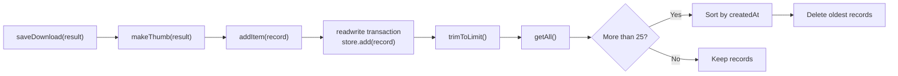

# Clipix

> A privacy-first, fully client-side image toolkit for compression, resizing, and
> background removal.

Clipix is a static web application. It has no application server, database
server, build step, or upload endpoint: the browser reads the selected file,
performs the image work locally, and creates a downloadable result.

## Contents

- [1. Project description](#1-project-description)
- [2. Goals and acceptance criteria](#2-goals-and-acceptance-criteria)
- [3. Functional and technical specifications](#3-functional-and-technical-specifications)
- [4. Runtime architecture](#4-runtime-architecture)
- [5. Compression pipeline](#5-compression-pipeline)
- [6. Background-removal pipeline](#6-background-removal-pipeline)
- [7. Persistence and caching](#7-persistence-and-caching)
- [8. Design and implementation notes](#8-design-and-implementation-notes)

---

## 1. Project description

### Features

1. **Image compression and resizing**
   The user can select or drop a JPEG, PNG, or WebP image, choose JPEG/WebP
   output, adjust quality, and set a maximum width. Aspect ratio is preserved.
2. **Batch compression**
   Multiple files are queued and processed by a bounded worker pool. Each row
   reports its own result and failure state.
3. **Background removal**
   An `@imgly/background-removal` model is loaded in a module Web Worker and
   returns a transparent PNG cut-out.
4. **Local history**
   Downloaded results are stored as Blobs in an IndexedDB object store. The
   History page supports re-download, deletion, clearing all records, and
   opening a stored result in the compressor.

### Privacy model

The selected image is passed to browser APIs, Web Workers, and the
background-removal runtime. Clipix does not send the image to a Clipix
application server. The first background-removal run can make network requests
for the JavaScript module, ONNX Runtime/WASM assets, and model files supplied by
the third-party library. This is different from uploading the user's image for
server-side processing.

## 2. Goals and acceptance criteria

| # | Goal | Acceptance criteria |
|---|---|---|
| G1 | Compress and resize locally | A supported image is converted in-browser with configurable quality, maximum width, and output format. |
| G2 | Remove backgrounds locally | A supported image produces a transparent PNG without sending the image to a Clipix server. |
| G3 | Keep the UI responsive | Compression work runs in dedicated workers; the background-removal request also runs in a module worker. |
| G4 | Support batch processing | The worker pool limits concurrency to `min(navigator.hardwareConcurrency || 2, 4)` and isolates per-file errors. |
| G5 | Persist useful history | Downloaded results survive refresh in IndexedDB and are listed newest first. |

## 3. Functional and technical specifications

### Compression

- Input: drag-and-drop or file picker; JPEG, PNG, and WebP are accepted.
- Single-image controls: quality (`0.1`–`1`), maximum width (`320`–`3840`
  pixels), and JPEG/WebP output.
- The compressor worker creates an `ImageBitmap`, scales it down when needed,
  draws it to an `OffscreenCanvas`, and calls `convertToBlob()`.
- Batch mode uses quality `0.7`, maximum width `1920px`, JPEG output, and up to
  four active worker jobs.
- A batch job reports progress and can retry a failed worker job up to two
  times before rejecting it.

### Background removal

- Input: drag-and-drop or file picker; JPEG, PNG, and WebP are accepted.
- The UI dynamically imports `workers/bgRemover.js` only when needed.
- That module creates one reusable module Worker. Requests are identified by
  monotonically increasing request IDs.
- The worker dynamically imports
  `https://cdn.jsdelivr.net/npm/@imgly/background-removal@1.7.0/+esm`.
- The library is asked to use `isnet_fp16` and produce `image/png`.
- Progress is separated into model/resource download progress and model
  computation progress.
- The result is displayed as a PNG and saved to history when the user clicks
  Download.

### History

Each downloaded result is stored in the `imageToolHistory` IndexedDB database,
inside the `history` object store:

```text
record {
  id:        number,       // autoIncrement object-store key
  createdAt: number,       // Date.now()
  operation: string,       // "compress" or "remove-background"
  sizes:     { before, after },
  format:    string,       // Blob MIME type
  thumb:     Blob,         // generated WebP thumbnail
  result:    Blob          // full downloadable result
}
```

The store has a `createdAt` index. History is loaded with `getAll()`, sorted
newest first in the UI, and capped at **25 records** by deleting the oldest
records. `getItem(id)` reads one record for the History page's **Open in
compressor** action. The result Blob is wrapped in a `File` and sent through
the same compressor path as a newly selected file.

### Non-functional requirements

| Category | Implementation |
|---|---|
| Privacy | No image upload to a Clipix backend; processing is browser-side. |
| Performance | Compression uses `Worker` and `OffscreenCanvas`; batch concurrency is bounded. |
| Persistence | IndexedDB stores result and thumbnail Blobs locally. |
| Reliability | Worker errors reject individual jobs; batch processing continues for other files. |
| Accessibility | Native buttons/links, labels, status regions, progress elements, and keyboard-friendly controls are used. |
| Maintainability | ES modules, small focused modules, and no compile-time build step. |

### Technology stack

| Layer | Technology |
|---|---|
| Markup and styling | HTML5 and CSS3 |
| Application logic | Vanilla JavaScript ES modules |
| Compression concurrency | Web Workers and the custom `WorkerPool` |
| Compression primitives | `createImageBitmap`, `OffscreenCanvas`, `convertToBlob` |
| Background removal | `@imgly/background-removal` with the `isnet_fp16` model configuration |
| ML execution | ONNX Runtime/WASM resources managed internally by the background-removal package |
| Persistent application data | IndexedDB database `imageToolHistory`, object store `history` |
| Resource caching | Browser HTTP/module cache as controlled by response headers; no service worker or explicit Cache API code is present |

## 4. Runtime architecture



The main thread owns DOM state, controls, previews, and download links. It
does not perform the expensive compression or segmentation operation itself.
The two processing paths are intentionally different:

- compression may create several workers for a batch;
- background removal uses one long-lived worker because the model and
  intermediate tensors are memory-intensive.

## 5. Compression pipeline

### Detailed stages

1. **Input validation:** `main.js` accepts a file only when its MIME type starts
   with `image/`.
2. **Job creation:** the selected file and the current quality, maximum width,
   output format, and request ID are sent as one worker payload.
3. **Scheduling:** `WorkerPool` assigns queued jobs to idle workers. Single
   image mode uses one worker; batch mode creates up to
   `min(navigator.hardwareConcurrency || 2, 4)` workers.
4. **Decode:** `compressor.js` decodes the input with `createImageBitmap()`.
5. **Resize:** the worker computes `min(1, maxWidth / bitmap.width)`, so images
   are never enlarged and their aspect ratio is preserved.
6. **Rasterization:** the decoded bitmap is drawn to an `OffscreenCanvas`, then
   released with `bitmap.close()`.
7. **Encoding:** `convertToBlob()` encodes the canvas as JPEG or WebP using the
   selected quality value.
8. **Presentation:** the result Blob is returned to `main.js`, which creates an
   object URL for the preview and download link.
9. **Persistence:** history is saved when the user activates the download link.
   `saveDownload()` generates a WebP thumbnail and stores both Blobs and size
   metadata in IndexedDB.


For a batch, `WorkerPool.run()` places each payload into a FIFO queue. An idle
worker receives the next payload. A worker response resolves that job and
immediately dispatches another queued job. A worker error is retried up to the
pool's retry limit; after that, only that job is rejected.

## 6. Background-removal pipeline

### Application request flow



### ONNX Runtime execution detail

Clipix does not call ONNX Runtime directly. The `@imgly/background-removal`
package owns the model session and its ONNX Runtime/WASM integration. The
effective execution flow is:



The worker reports `fetch*` progress as **download** progress and reports
non-fetch progress as **compute** progress. This distinction is why the UI can
show “Downloading model…” before switching to “Removing background…”.

### Resource and browser-cache flow



There are two separate storage concerns:

1. **Model/runtime resource caching:** the CDN/module loader and browser network
   stack may reuse JavaScript, WASM, and model responses according to their
   HTTP cache headers. Clipix does not currently open a Cache API cache, write
   model files to IndexedDB, or register a service worker.
2. **History persistence:** Clipix explicitly writes user-generated thumbnails
   and result Blobs to the `history` IndexedDB object store. These records are
   not the ONNX model cache and deleting history does not necessarily clear
   browser HTTP cache entries.

Therefore the first run may require network access, while later runs can be
faster if the browser still has valid cached runtime/model responses. Exact
cache lifetime and eviction are browser/CDN decisions, not application
guarantees.

## 7. Persistence and caching

### IndexedDB transaction model

`db.js` opens `imageToolHistory` version 1 and creates the `history` object
store with an auto-increment key and `createdAt` index during
`onupgradeneeded`. Each helper opens a transaction, waits for transaction
completion, closes the database connection, and rejects on transaction errors.



The History page creates object URLs for thumbnails and revokes prior URLs
before rerendering. Downloads create a temporary object URL for the full
result and revoke it after the browser has had time to start the download.

## 8. Design and implementation notes

- `html/index.html` is the compressor page; `html/bgremover.html` is the
  background-removal page; `html/history.html` lists stored results.
- `main.js` and `bgremover.js` are page controllers. `history.js` owns both
  history persistence orchestration and History page rendering.
- `workers/compressor.js` uses transferable-friendly browser image primitives
  but returns the resulting Blob through `postMessage`.
- `workers/bgRemover.js` is a request/response bridge that keeps pending
  promises keyed by request ID and resets the worker after an uncaught worker
  error.
- The History “Open in compressor” action reads a single IndexedDB record using
  `getItem(id)`, wraps `item.result` in a `File`, and calls the normal
  compressor input path.
